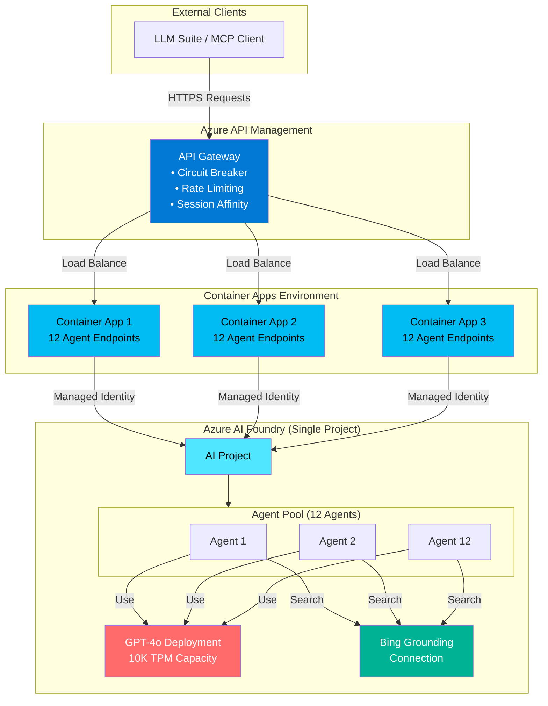
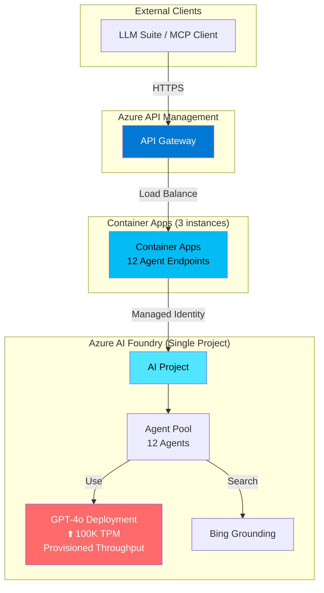
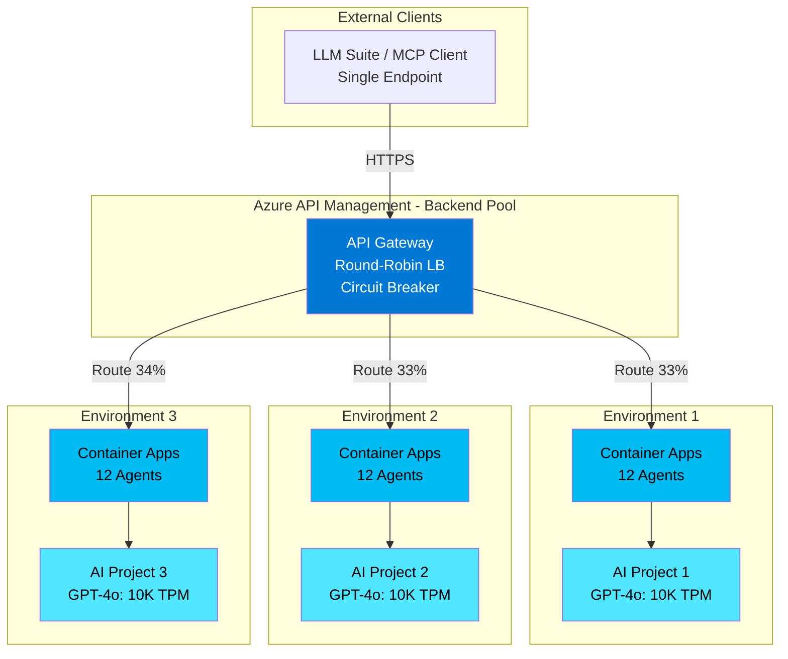
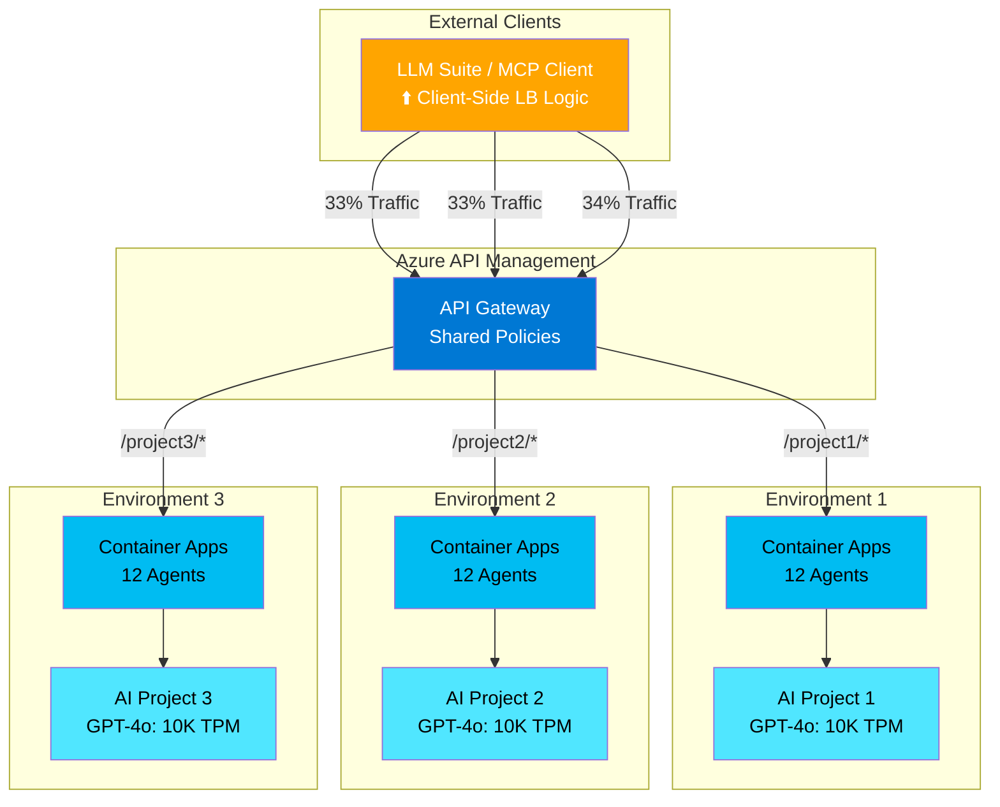
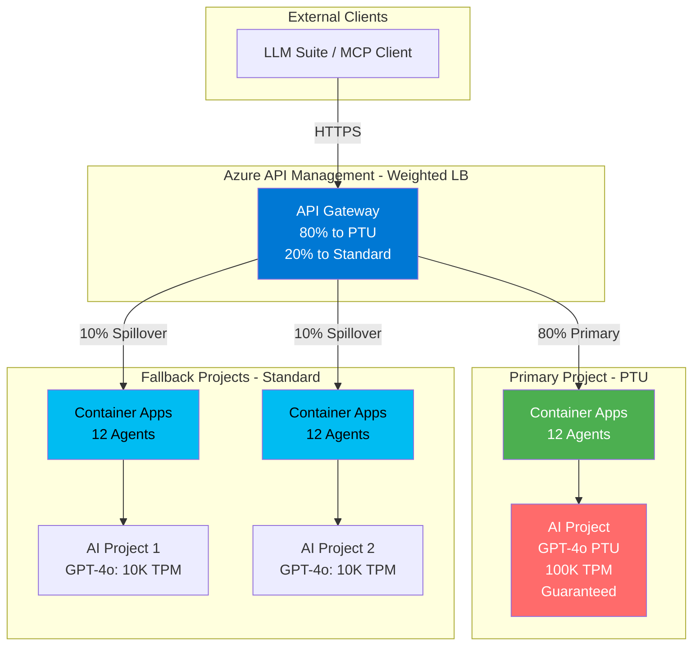

# Bing Grounding API

A FastAPI-based wrapper for Azure AI Agent Service with Bing grounding capabilities. This service provides a REST API for performing web searches with AI-powered grounding and automatic citation extraction.

## Features

✅ REST API wrapper for Azure AI Agent with Bing grounding  
✅ Structured JSON responses with citations  
✅ Docker containerization for easy deployment  
✅ Health check endpoint  
✅ Azure Container Apps ready  
✅ Thread management and cleanup  
✅ **APIM load balancing with circuit breaker pattern**  
✅ **Session affinity (sticky sessions)**  
✅ **Automatic failover and recovery**  
✅ **Automated deployment with Azure Developer CLI (azd)**  
✅ **12 AI agents created automatically during provisioning**

---

## Quick Start: Provision & Deploy to Azure

The fastest way to get started is with Azure Developer CLI:

```bash
# 1. Login to Azure
azd auth login

# 2. Create and deploy environment (one command!)
azd env new <environment-name>
azd up
```

That's it! This will:
- ✅ Create all Azure resources (Container Apps, AI Foundry, Storage, etc.)
- ✅ Automatically create 12 GPT-4o AI agents with Bing grounding
- ✅ Build and deploy the Docker container
- ✅ Configure managed identities and RBAC
- ✅ Set up API Management with load balancing

**The entire process takes approximately 8-15 minutes.**

Your API will be available at the endpoint shown in the output.

📚 **For detailed provisioning steps**, see [Deployment to Azure](#deployment-to-azure) below.

> **💡 MCP Server via APIM**: Azure API Management natively converts your REST API into a Model Context Protocol (MCP) server. MCP clients (like GitHub Copilot, Semantic Kernel, or Azure OpenAI Responses API) connect to APIM's MCP endpoint via HTTP/SSE transport to access your API as standardized tools. See [APIM as MCP Server](docs/APIM_MCP_SERVER.md) for details.
> 
> **⚠️ Manual Step Required After Deployment**: The `azd deploy` postdeploy hook will display instructions for creating the MCP server in APIM Portal (1-2 minutes). This step is currently manual because MCP server resources are not yet available in ARM/Bicep templates.

---  

## Architecture

### Current Architecture: Single Project with Agent Pool



**Characteristics:**
- ✅ **TPM Capacity:** 10K TPM (shared across all agents)
- ✅ **Agent Pool:** 12 agents for load distribution
- ✅ **High Availability:** 3 Container App instances
- ✅ **APIM Load Balancing:** Across Container Apps only
- ⚠️ **Single TPM Quota:** All agents share same GPT-4o deployment

**Use Case:** Development, pilot projects, moderate production workloads (up to ~300K queries/month)

**Monthly Cost:** ~$2,000 (See [Cost Analysis](#cost-analysis) below)

---

## Scale-Out Strategies

As your workload grows beyond 10K TPM capacity, you have several options to scale. Each strategy has different trade-offs in terms of complexity, cost, and LLM Suite integration.

### Strategy 1: Vertical Scale (Increase TPM per Project)



**Implementation:**
- Increase GPT-4o deployment from 10K to 100K TPM (or higher)
- Use Provisioned Throughput Units (PTU) for guaranteed capacity
- No architecture changes required

**Characteristics:**
- ✅ **Simplest approach** - No code changes
- ✅ **Single endpoint** for LLM Suite
- ✅ **Up to 1M TPM** with PTU
- ⚠️ **Higher cost** - PTU pricing (~$540/PTU/month)
- ⚠️ **Single point of failure** (one project)

**LLM Suite Integration:**
- **No changes required** - Same endpoint structure
- Continue using `/bing-grounding/gpt4o_{1-12}` endpoints

**Monthly Cost:** ~$5K-50K depending on PTU allocation

**When to use:** When you need quick scaling without architectural changes

---

### Strategy 2: Horizontal Scale with Multiple Projects (APIM Managed)



**Implementation:**

1. **Deploy multiple environments:**
   ```bash
   # Create 3 separate environments
   azd env new prod-foundry-1
   azd up
   
   azd env new prod-foundry-2
   azd up
   
   azd env new prod-foundry-3
   azd up
   ```

2. **Configure APIM backend pool:**
   ```xml
   <backends>
     <backend id="foundry-pool">
       <backend>
         <url>https://ca-foundry1.azurecontainerapps.io</url>
       </backend>
       <backend>
         <url>https://ca-foundry2.azurecontainerapps.io</url>
       </backend>
       <backend>
         <url>https://ca-foundry3.azurecontainerapps.io</url>
       </backend>
     </backend>
   </backends>
   
   <inbound>
     <set-backend-service backend-id="foundry-pool" />
   </inbound>
   ```

**Characteristics:**
- ✅ **Linear capacity scaling** (3 projects × 10K = 30K TPM)
- ✅ **Fault tolerance** - Project failures don't affect others
- ✅ **Cost efficient** - Pay-per-use pricing
- ✅ **Single endpoint** for LLM Suite (APIM handles routing)
- ⚠️ **More infrastructure** to manage (3 environments)
- ⚠️ **Requires APIM configuration** update

**LLM Suite Integration:**
- **No changes required** - LLM Suite sees single APIM endpoint
- APIM transparently routes to available Foundry projects
- Maintains same `/bing-grounding/gpt4o_{1-12}` endpoint structure

**Monthly Cost:** ~$6K (3 environments × $2K each)

**When to use:** 
- Need 20K-50K TPM capacity
- Want fault tolerance across projects
- Prefer pay-per-use over PTU pricing

---

### Strategy 3: Horizontal Scale with Client-Side Load Balancing



**Implementation:**

1. **Deploy multiple environments with distinct paths:**
   ```bash
   azd env new prod-foundry-1
   azd up
   # Endpoint: https://apim.azure-api.net/project1/bing-grounding
   
   azd env new prod-foundry-2
   azd up
   # Endpoint: https://apim.azure-api.net/project2/bing-grounding
   
   azd env new prod-foundry-3
   azd up
   # Endpoint: https://apim.azure-api.net/project3/bing-grounding
   ```

2. **Configure APIM routing:**
   ```xml
   <choose>
     <when condition="@(context.Request.Url.Path.StartsWith("/project1"))">
       <set-backend-service base-url="https://ca-foundry1.azurecontainerapps.io" />
     </when>
     <when condition="@(context.Request.Url.Path.StartsWith("/project2"))">
       <set-backend-service base-url="https://ca-foundry2.azurecontainerapps.io" />
     </when>
     <when condition="@(context.Request.Url.Path.StartsWith("/project3"))">
       <set-backend-service base-url="https://ca-foundry3.azurecontainerapps.io" />
     </when>
   </choose>
   ```

3. **Update LLM Suite configuration:**
   ```yaml
   # LLM Suite config
   foundry_endpoints:
     - url: https://apim.azure-api.net/project1/bing-grounding
       weight: 33
       capacity: 10000  # TPM
     - url: https://apim.azure-api.net/project2/bing-grounding
       weight: 33
       capacity: 10000
     - url: https://apim.azure-api.net/project3/bing-grounding
       weight: 34
       capacity: 10000
   
   load_balancing:
     strategy: round-robin  # or weighted, least-connections
     health_check_interval: 30s
   ```

**Characteristics:**
- ✅ **Full control** over routing logic in LLM Suite
- ✅ **Project-specific routing** for workload segregation
- ✅ **Custom failover** logic possible
- ✅ **Cost visibility** per project endpoint
- ⚠️ **LLM Suite changes required** (configuration + logic)
- ⚠️ **More complex** client implementation
- ⚠️ **Manual endpoint management**

**LLM Suite Integration:**
- **Configuration changes required** - Multiple endpoints
- **Load balancing logic required** - Client-side round-robin/weighted
- **Health monitoring recommended** - Check endpoint availability
- **Per-agent endpoints:**
  - Project 1: `/project1/bing-grounding/gpt4o_{1-12}`
  - Project 2: `/project2/bing-grounding/gpt4o_{1-12}`
  - Project 3: `/project3/bing-grounding/gpt4o_{1-12}`

**Monthly Cost:** ~$6K (3 environments × $2K each)

**When to use:**
- Need advanced routing logic (tenant isolation, workload prioritization)
- Want fine-grained control over traffic distribution
- LLM Suite already has load balancing capabilities
- Need per-project cost tracking

---

### Strategy 4: Hybrid - PTU + Multi-Project



**Implementation:**

1. **Deploy primary PTU project:**
   ```bash
   # Modify infra/resources.bicep to use PTU
   param openAiDeploymentType string = 'ProvisionedThroughput'
   param openAiCapacity int = 100  # 100 PTUs
   
   azd env new prod-primary
   azd up
   ```

2. **Deploy fallback standard projects:**
   ```bash
   azd env new prod-fallback-1
   azd up
   
   azd env new prod-fallback-2
   azd up
   ```

3. **Configure weighted APIM routing:**
   ```xml
   <set-variable name="backendIndex" value="@{
       var rand = new Random().Next(100);
       if (rand < 80) return "ptu";      // 80% to PTU
       if (rand < 90) return "std1";     // 10% to Standard 1
       return "std2";                     // 10% to Standard 2
   }" />
   
   <choose>
     <when condition="@(context.Variables["backendIndex"] == "ptu")">
       <set-backend-service base-url="https://ca-ptu.azurecontainerapps.io" />
     </when>
     <when condition="@(context.Variables["backendIndex"] == "std1")">
       <set-backend-service base-url="https://ca-std1.azurecontainerapps.io" />
     </when>
     <otherwise>
       <set-backend-service base-url="https://ca-std2.azurecontainerapps.io" />
     </otherwise>
   </choose>
   ```

**Characteristics:**
- ✅ **Guaranteed capacity** (100K TPM from PTU)
- ✅ **Burst capacity** (additional 20K TPM from standard)
- ✅ **Cost optimized** - PTU for baseline, pay-per-use for spikes
- ✅ **High availability** - Multiple fallback projects
- ⚠️ **Complex configuration** - Weighted routing + health checks
- ⚠️ **Higher base cost** - PTU commitment

**LLM Suite Integration:**
- **No changes required** - Single APIM endpoint
- APIM handles weighted routing automatically
- Transparent failover to standard projects

**Monthly Cost:** ~$25K (PTU: $21K + 2 standard projects: $4K)

**When to use:**
- Need guaranteed baseline capacity (100K TPM)
- Expect traffic spikes beyond PTU allocation
- Want cost predictability with burst capability
- Mission-critical workloads requiring SLA

---

### Comparison Matrix

| Strategy | Max TPM | HA | Cost/Month | LLM Suite Changes | Complexity | Best For |
|----------|---------|-----|-----------|-------------------|------------|----------|
| **Strategy 1: Vertical (PTU)** | 1M+ | Medium | $5K-50K | None | Low | Quick scaling, predictable load |
| **Strategy 2: Horizontal (APIM LB)** | 50K+ | High | $6K+ | None | Medium | Cost efficiency, fault tolerance |
| **Strategy 3: Horizontal (Client LB)** | 50K+ | High | $6K+ | Configuration + Logic | High | Advanced routing, tenant isolation |
| **Strategy 4: Hybrid (PTU + Multi)** | 120K+ | Very High | $25K+ | None | High | Mission-critical, guaranteed capacity |

---

### Recommendation by Workload

**Pilot / Development (< 10K TPM):**
- Use current single-project architecture
- Cost: ~$2K/month
- Scale strategy: None needed

**Production - Light (10K-30K TPM):**
- **Recommended:** Strategy 2 (Horizontal with APIM LB)
- Deploy 2-3 projects
- Cost: ~$4K-6K/month
- LLM Suite: No changes

**Production - Medium (30K-100K TPM):**
- **Recommended:** Strategy 1 (Vertical PTU)
- Single project with 50-100 PTUs
- Cost: ~$27K-54K/month
- LLM Suite: No changes

**Production - Heavy (100K+ TPM):**
- **Recommended:** Strategy 4 (Hybrid PTU + Multi-Project)
- PTU baseline + standard fallbacks
- Cost: ~$25K+ /month
- LLM Suite: No changes

**Enterprise - Mission Critical:**
- **Recommended:** Strategy 4 + Multi-region
- Deploy across 2-3 Azure regions
- Cost: ~$75K+/month
- LLM Suite: Optional geo-routing

---

## Prerequisites

### For Local Development
- **Python 3.11+** - [Download](https://www.python.org/downloads/)
- **Azure CLI** - [Install Guide](https://learn.microsoft.com/cli/azure/install-azure-cli)
- **Docker Desktop** (optional, for Docker Compose) - [Download](https://www.docker.com/products/docker-desktop)
- **Azure subscription** with access to:
  - Azure AI Foundry
  - Azure Container Apps
  - Azure API Management (optional, for production)

### For Azure Deployment
- **Azure Developer CLI (azd)** - [Install Guide](https://learn.microsoft.com/azure/developer/azure-developer-cli/install-azd)
- **Docker** (for building container images) - [Download](https://www.docker.com/products/docker-desktop)
- **Azure CLI** - [Install Guide](https://learn.microsoft.com/cli/azure/install-azure-cli)

### Azure Permissions Required
- **Subscription Contributor** or **Owner** role (to create resource groups and resources)
- **Azure AI Developer** or **Cognitive Services Contributor** (to create AI Foundry projects)

---

## Getting Started

### Local Development

1. **Create virtual environment**
   ```bash
   _env_create.bat
   ```

2. **Activate virtual environment**
   ```bash
   _env_activate.bat
   ```

3. **Install dependencies**
   ```bash
   _install.bat
   ```

4. **Configure environment variables**
   - Copy `env.sample` to `.env`
   - Fill in your Azure AI Agent credentials:
     ```env
     AZURE_AI_PROJECT_ENDPOINT="https://your-project.services.ai.azure.com/api/projects/yourProject"
     AZURE_AI_AGENT_ID="asst_xxxxxxxxxxxxx"
     ```

5. **Start the server**
   ```bash
   _run_server.bat
   ```

The API will be available at `http://localhost:8989`

### Docker Development

1. **Start with Docker Compose**
   ```bash
   _up.bat
   ```

2. **Stop Docker Compose**
   ```bash
   _down.bat
   ```

## API Endpoints

### GET /health

Health check endpoint that verifies the service is running.

**Example:**
```bash
curl http://localhost:8989/health
```

**Response:**
```json
{
  "status": "ok",
  "service": "bing-grounding-api"
}
```

### POST /bing-grounding

Azure AI Agent wrapper endpoint with Bing grounding and citation support.

**Parameters:**
- `query` (string, required) - The user query to process

**Example:**
```bash
curl -X POST "http://localhost:8989/bing-grounding?query=What+happened+in+finance+today?"
```

**Success Response:**
```json
{
  "content": "Today in finance, the U.S. stock market saw a sharp decline, with the Dow Jones Industrial Average plunging almost 800 points (down 1.6%), and both the Nasdaq and S&P 500 also posting significant losses...",
  "citations": [
    {
      "id": 1,
      "type": "url",
      "url": "https://www.marketwatch.com/...",
      "title": "Stock Market News Today"
    },
    {
      "id": 2,
      "type": "url",
      "url": "https://www.cnbc.com/...",
      "title": "Federal Reserve Commentary"
    }
  ]
}
```

**Error Response:**
```json
{
  "error": "processing_error",
  "message": "Error details..."
}
```

**Features:**
- ✅ Grounded responses using Bing search
- ✅ Automatic citation extraction and formatting
- ✅ Clean content (inline citation markers removed)
- ✅ Structured JSON response

## Azure AI Agent Configuration

This service wraps an Azure AI Agent that must be configured with Bing grounding capabilities.

### Setting Up Your Azure AI Agent

1. Create an Azure AI Project
2. Create an AI Agent with Bing grounding enabled
3. Copy the Project Endpoint and Agent ID
4. Set them as environment variables

### Environment Variables

| Variable | Description | Required | Example |
|----------|-------------|----------|---------|
| `AZURE_AI_PROJECT_ENDPOINT` | Azure AI Project endpoint | Always | `https://your-project.services.ai.azure.com/api/projects/yourProject` |
| `AZURE_AI_AGENT_ID` | Azure AI Agent ID | Always | `asst_xxxxxxxxxxxxx` |
| `AZURE_CLIENT_ID` | Service Principal App ID | Local testing only | `xxxxxxxx-xxxx-xxxx-xxxx-xxxxxxxxxxxx` |
| `AZURE_CLIENT_SECRET` | Service Principal Secret | Local testing only | `your-secret-value` |
| `AZURE_TENANT_ID` | Azure AD Tenant ID | Local testing only | `xxxxxxxx-xxxx-xxxx-xxxx-xxxxxxxxxxxx` |

### Authentication Setup

#### For Local Testing (Service Principal)

1. **Create a Service Principal**:
   ```bash
   az ad sp create-for-rbac --name "bing-grounding-api-sp" --role Contributor
   ```

   This returns:
   ```json
   {
     "appId": "xxxxxxxx-xxxx-xxxx-xxxx-xxxxxxxxxxxx",          # AZURE_CLIENT_ID
     "password": "your-secret-here",                           # AZURE_CLIENT_SECRET
     "tenant": "xxxxxxxx-xxxx-xxxx-xxxx-xxxxxxxxxxxx"         # AZURE_TENANT_ID
   }
   ```

2. **Grant Access to AI Project**:
   ```bash
   # Get your subscription ID and resource group from Azure Portal
   az role assignment create \
     --assignee <appId-from-above> \
     --role "Cognitive Services User" \
     --scope "/subscriptions/<sub-id>/resourceGroups/<rg>/providers/Microsoft.CognitiveServices/accounts/<ai-project-name>"
   ```

3. **Update your `.env` file**:
   ```env
   AZURE_AI_PROJECT_ENDPOINT=https://your-region.services.ai.azure.com/api/projects/your-project
   AZURE_AI_AGENT_ID=asst_xxxxxxxxxxxxx
   AZURE_CLIENT_ID=xxxxxxxx-xxxx-xxxx-xxxx-xxxxxxxxxxxx
   AZURE_CLIENT_SECRET=your-secret-here
   AZURE_TENANT_ID=xxxxxxxx-xxxx-xxxx-xxxx-xxxxxxxxxxxx
   ```

#### For Production (Managed Identity)

When deploying to Azure Container Apps, use Managed Identity instead:

1. **Enable Managed Identity** on your Container App:
   ```bash
   az containerapp identity assign \
     --name bing-grounding-api \
     --resource-group your-rg \
     --system-assigned
   ```

2. **Grant the Managed Identity access** to your AI Project:
   ```bash
   # Get the principal ID from the output above or:
   PRINCIPAL_ID=$(az containerapp identity show \
     --name bing-grounding-api \
     --resource-group your-rg \
     --query principalId -o tsv)

   # Grant access
   az role assignment create \
     --assignee $PRINCIPAL_ID \
     --role "Cognitive Services User" \
     --scope "/subscriptions/<sub-id>/resourceGroups/<rg>/providers/Microsoft.CognitiveServices/accounts/<ai-project-name>"
   ```

3. **Deploy with only the required variables** (no client secrets):
   ```bash
   az containerapp create \
     --name bing-grounding-api \
     --resource-group your-rg \
     --environment your-env \
     --image your-registry.azurecr.io/bing-grounding-api:latest \
     --target-port 8989 \
     --ingress external \
     --system-assigned \
     --env-vars \
       AZURE_AI_PROJECT_ENDPOINT="your-endpoint" \
       AZURE_AI_AGENT_ID="your-agent-id"
   ```

**Important**: Don't set `AZURE_CLIENT_ID`, `AZURE_CLIENT_SECRET`, or `AZURE_TENANT_ID` in production. The `DefaultAzureCredential` will automatically use the Managed Identity.

## Project Structure

```
ai-bing-grounding-mcp/
├── agents/                         # AI Agent implementations
│   ├── __init__.py
│   ├── base_agent.py              # Abstract base class
│   └── bing_grounding.py          # Bing grounding agent
├── ai/                             # (Legacy - not used)
│   ├── __init__.py
│   └── azure_openai_client.py
├── app/                            # FastAPI application
│   ├── __init__.py
│   └── main.py                    # API endpoints
├── apim-policy.xml                # Main APIM policy (load balancing + circuit breaker)
├── apim-policy-with-healthcheck.xml  # Enhanced APIM policy with active health checks
├── apim-healthcheck-monitor.xml   # Optional active health monitoring policy
├── docker-compose.yaml            # Local Docker development
├── dockerfile                     # Container image definition
├── env.sample                     # Environment variable template
├── main.py                        # Application entry point
├── requirements.txt               # Python dependencies
├── _env_activate.bat              # Activate virtual environment
├── _env_create.bat                # Create virtual environment
├── _install.bat                   # Install dependencies
├── _run_server.bat                # Run FastAPI server
├── _up.bat                        # Start Docker Compose
├── _down.bat                      # Stop Docker Compose
└── README.md                      # This file
```

## Deployment to Azure

### Option 1: Automated Deployment with Azure Developer CLI (⭐ Recommended)

Azure Developer CLI (`azd`) automates the entire deployment process - from creating infrastructure to deploying applications. **This is the recommended approach** for both development and production deployments.

**What gets deployed automatically:**
- 🏗️ Azure Container Apps Environment + 3 Container App instances
- 🤖 Azure AI Foundry Hub & Project
- 🤖 12 GPT-4o AI agents with Bing grounding (created programmatically!)
- 🔐 Azure Container Registry
- 🔐 Key Vault with managed identities
- 📊 Log Analytics & Application Insights
- 🌐 Azure API Management (with load balancing and circuit breaker)
- 🔒 RBAC role assignments for all resources

**Total deployment time: ~8-15 minutes** ⏱️

---

#### Prerequisites

Before starting, ensure you have:

**Required:**
- Azure subscription with Contributor or Owner role
- Azure Developer CLI (`azd`) - [Install Guide](https://learn.microsoft.com/azure/developer/azure-developer-cli/install-azd)
- Azure CLI (`az`) - [Install Guide](https://learn.microsoft.com/cli/azure/install-azure-cli)
- Docker Desktop - [Download](https://www.docker.com/products/docker-desktop)

**Optional (for local development):**
- Python 3.11+ - [Download](https://www.python.org/downloads/)

**Quick install commands:**

```bash
# Windows (PowerShell)
powershell -ex AllSigned -c "Invoke-RestMethod 'https://aka.ms/install-azd.ps1' | Invoke-Expression"

# macOS/Linux
curl -fsSL https://aka.ms/install-azd.sh | bash
```

---

#### Step 1: Login to Azure

```bash
azd auth login
```

This opens a browser for authentication. Once authenticated, you're ready to deploy.

---

#### Step 2: Deploy Everything (One Command)

The simplest approach is to use `azd up`, which creates the environment, provisions infrastructure, and deploys the application in one step:

```bash
azd up
```

**You'll be prompted for:**
- **Environment name**: e.g., `dev`, `staging`, `prod`
  - Creates resource group: `rg-bing-grounding-mcp-{env-name}`
- **Azure subscription**: Select from your subscriptions
- **Azure location**: e.g., `eastus2`, `westus2`
- **Resource group confirmation**: If it already exists, confirm to continue

**What happens during `azd up`:**

1. **Preprovision Hooks** (~30 seconds)
   - ✅ Check resource group status
   - ✅ Register Microsoft.Bing resource provider

2. **Infrastructure Provisioning** (~5-10 minutes)
   - 🏗️ Create Container Registry
   - 🏗️ Create Container Apps Environment
   - 🏗️ Create AI Foundry Hub & Project
   - 🏗️ Deploy GPT-4o model
   - 🏗️ Create Key Vault, Storage, Log Analytics
   - 🏗️ Create API Management
   - 🏗️ Configure managed identities and RBAC

3. **Postprovision Hooks** (~2-3 minutes)
   - 🤖 **Create 12 GPT-4o AI agents with Bing grounding**
   - 📝 Save agent IDs to environment

4. **Application Deployment** (~3-5 minutes)
   - 🐳 Build Docker image
   - 📤 Push to Azure Container Registry
   - 🚀 Deploy to all 3 Container App instances

5. **Postdeploy Hooks** (~1 minute)
   - 🔄 Update additional container instances

**After completion**, you'll see:
```
SUCCESS: Your application was provisioned and deployed to Azure in X minutes.

You can view the application at https://ca-xxxxxx.eastus2.azurecontainerapps.io
```

That's it! Your API is live with 12 AI agents ready to serve requests.

---

#### Step 2 (Alternative): Separate Provision and Deploy

If you prefer more control, you can separate the steps:

**A. Create environment:**
   ```bash
   azd env new <environment-name>
   ```
   
   Examples:
   - `azd env new dev` → Creates `rg-bing-grounding-mcp-dev`
   - `azd env new prod` → Creates `rg-bing-grounding-mcp-prod`

**B. Provision infrastructure:**
   ```bash
   azd provision
   ```
   
   This creates all Azure resources and runs the postprovision hook to create AI agents.

**C. Deploy application:**
   ```bash
   azd deploy
   ```
   
   This builds and deploys the Docker container to all instances.

---

#### Step 3: Test Your Deployment

**Get your endpoint:**
```bash
azd env get-values | grep AZURE_CONTAINER_APP_ENDPOINT
# or
azd env get-values | findstr AZURE_CONTAINER_APP_ENDPOINT  # Windows
```

**Test the API:**
```bash
# Health check
curl https://ca-xxxxxx.eastus2.azurecontainerapps.io/health

# List agents
curl https://ca-xxxxxx.eastus2.azurecontainerapps.io/agents

# Query with Bing grounding
curl -X POST "https://ca-xxxxxx.eastus2.azurecontainerapps.io/bing-grounding/gpt4o_1?query=What+is+Azure+AI+Foundry?"
```

---

### Advanced Configuration

#### Pre-Configure Environment (Optional)

For CI/CD pipelines or scripted deployments, you can pre-configure values to avoid interactive prompts:
```bash
# Create environment
azd env new <env-name>

# Set subscription (find with: az account list -o table)
azd env set AZURE_SUBSCRIPTION_ID "xxxxxxxx-xxxx-xxxx-xxxx-xxxxxxxxxxxx"

# Set location
azd env set AZURE_LOCATION "eastus2"

# Now provision and deploy without prompts
azd up
```

**When to pre-configure:**
- ✅ CI/CD pipelines (GitHub Actions, Azure DevOps)
- ✅ Automated/scripted deployments
- ✅ Enforcing team standards
- ✅ Multi-environment deployments (dev/staging/prod)

#### View Environment Configuration

```bash
# Show all environment variables and outputs
azd env get-values

# Show deployment status and endpoints
azd show
```

---

### Common Workflows

#### Update Application Code

When you change Python code:

```bash
azd deploy
```

This rebuilds the Docker image and updates all Container App instances with zero downtime (~3-5 min).

#### Update Infrastructure

When you modify Bicep templates in `infra/`:

```bash
azd provision
```

This applies infrastructure changes without redeploying the application (~2-5 min).

#### View Logs

```bash
# Get resource group from environment
RG=$(azd env get-values | grep AZURE_RESOURCE_GROUP | cut -d'=' -f2 | tr -d '"')

# Get Container App name
CA_NAME=$(azd env get-values | grep AZURE_CONTAINER_APP_NAME | cut -d'=' -f2 | tr -d '"')

# Stream logs
az containerapp logs show --name $CA_NAME --resource-group $RG --follow
```

#### Multiple Environments (Dev/Staging/Prod)

```bash
# Create and deploy dev environment
azd env new dev
azd env set AZURE_LOCATION "eastus2"
azd up

# Create and deploy prod environment
azd env new prod
azd env set AZURE_LOCATION "eastus"
azd up

# Switch between environments
azd env select dev
azd env select prod

# List all environments
azd env list
```

Each environment gets:
- Separate resource group: `rg-bing-grounding-mcp-{env}`
- Isolated Azure resources
- Local configuration in `.azure/{env}/`

#### Tear Down Resources

```bash
# Delete all Azure resources (with confirmation)
azd down

# Delete without prompts
azd down --force --purge
```

⚠️ **Warning**: This deletes the entire resource group and all resources.

---

### What Gets Created Automatically

When you run `azd up`, the following resources are provisioned:

| Resource | Purpose | Details |
|----------|---------|---------|
| **Resource Group** | Logical container | `rg-bing-grounding-mcp-{env}` |
| **Container Registry** | Docker images | Private registry for app images |
| **Container Apps (×3)** | Application hosting | 3 instances for load balancing |
| **AI Foundry Hub** | AI infrastructure | Hub for AI projects |
| **AI Foundry Project** | AI agent management | Contains GPT-4o deployment |
| **12 AI Agents** | Bing grounding agents | Created programmatically via API |
| **API Management** | API gateway | Load balancing + circuit breaker |
| **Key Vault** | Secrets management | Stores sensitive configuration |
| **Storage Account** | Data storage | For AI Hub and logs |
| **Log Analytics** | Monitoring | Centralized logging |
| **Application Insights** | APM | Performance monitoring |
| **Managed Identities** | Authentication | Secure service-to-service auth |

**Total cost estimate**: ~$200-400/month depending on usage and SKUs.

---

### Automated Hooks Explained

The solution uses `azd` hooks to automate setup tasks:

**Preprovision Hooks** (before infrastructure):
1. **Check resource group** - Prompts if RG already exists
2. **Register providers** - Registers `Microsoft.Bing` provider

**Postprovision Hooks** (after infrastructure):
1. **Create AI agents** - Programmatically creates 12 GPT-4o agents with Bing grounding
2. **Save agent IDs** - Stores IDs as environment variables

**Postdeploy Hooks** (after deployment):
1. **Update container instances** - Updates additional instances with latest image

These hooks are defined in `azure.yaml` and run automatically - **no manual intervention required**.

---

### Troubleshooting Deployment

**Issue**: `azd provision` fails with subscription error
- **Fix**: Set subscription explicitly: `azd env set AZURE_SUBSCRIPTION_ID "your-sub-id"`
- **Fix**: Ensure you have Contributor/Owner role on subscription

**Issue**: Container deployment fails with "image not found"
- **Fix**: Ensure Docker is running locally
- **Fix**: Check ACR credentials: `az acr login --name <registry-name>`

**Issue**: AI agents not created
- **Fix**: Check logs: `cat .azure/{env}/.env | grep AZURE_AI_AGENT`
- **Fix**: Manually run: `python scripts/postprovision_create_agents.py`

**Issue**: Authentication errors when accessing AI Project
- **Fix**: Verify managed identity has "Cognitive Services User" role
- **Fix**: Check RBAC assignments in Azure Portal

---

### Best Practices

✅ **Use `azd up`** for first deployment and combined infrastructure+code changes  
✅ **Use `azd deploy`** for code-only changes (faster)  
✅ **Use separate environments** for dev/staging/prod isolation  
✅ **Never commit `.azure/` folder** - it contains environment-specific configs  
✅ **Review outputs** after each deployment with `azd env get-values`  
✅ **Test in dev** before deploying to production  
✅ **Use managed identities** (default) instead of service principals  
✅ **Monitor costs** with Azure Cost Management  

---

📚 **Learn More:**
- [Azure Developer CLI Documentation](https://learn.microsoft.com/azure/developer/azure-developer-cli/)
- [Azure Container Apps Documentation](https://learn.microsoft.com/azure/container-apps/)
- [Azure AI Foundry Documentation](https://learn.microsoft.com/azure/ai-services/)

---

### Option 2: Manual Deployment with Azure CLI

If you prefer manual control or can't use `azd`:

#### Step 1: Create Infrastructure

1. **Create resource group**:
   ```bash
   az group create --name rg-bing-grounding --location eastus
   ```

2. **Create Azure Container Registry**:
   ```bash
   az acr create \
     --resource-group rg-bing-grounding \
     --name acrbing123 \
     --sku Basic \
     --admin-enabled true
   ```

3. **Create AI Foundry Hub and Project** (via Azure Portal):
   - Go to https://ai.azure.com
   - Create a new Hub
   - Create a new Project within the Hub
   - Note the Project Endpoint

4. **Create Container App Environment**:
   ```bash
   az containerapp env create \
     --name cae-bing-grounding \
     --resource-group rg-bing-grounding \
     --location eastus
   ```

#### Step 2: Build and Push Container Image

1. **Login to ACR**:
   ```bash
   az acr login --name acrbing123
   ```

2. **Build and push image**:
   ```bash
   docker build -t acrbing123.azurecr.io/bing-grounding-api:latest .
   docker push acrbing123.azurecr.io/bing-grounding-api:latest
   ```

#### Step 3: Deploy Container Apps (Multiple Instances)

```bash
# Get ACR credentials
ACR_USERNAME=$(az acr credential show --name acrbing123 --query username -o tsv)
ACR_PASSWORD=$(az acr credential show --name acrbing123 --query passwords[0].value -o tsv)

# Deploy instance 1
az containerapp create \
  --name bing-grounding-api-0 \
  --resource-group rg-bing-grounding \
  --environment cae-bing-grounding \
  --image acrbing123.azurecr.io/bing-grounding-api:latest \
  --target-port 8989 \
  --ingress external \
  --registry-server acrbing123.azurecr.io \
  --registry-username $ACR_USERNAME \
  --registry-password $ACR_PASSWORD \
  --system-assigned \
  --env-vars \
    AZURE_AI_PROJECT_ENDPOINT="https://eastus.services.ai.azure.com/api/projects/yourProject" \
    AZURE_AI_AGENT_ID="asst_xxxxxxxxxxxxx"

# Repeat for instances 1 and 2
az containerapp create --name bing-grounding-api-1 ... (same parameters)
az containerapp create --name bing-grounding-api-2 ... (same parameters)
```

#### Step 4: Grant Managed Identity Access

```bash
# Get managed identity principal IDs
PRINCIPAL_ID_0=$(az containerapp identity show \
  --name bing-grounding-api-0 \
  --resource-group rg-bing-grounding \
  --query principalId -o tsv)

# Grant access to AI Project (repeat for each instance)
az role assignment create \
  --assignee $PRINCIPAL_ID_0 \
  --role "Cognitive Services User" \
  --scope "/subscriptions/<sub-id>/resourceGroups/rg-bing-grounding/providers/Microsoft.CognitiveServices/accounts/<ai-project-name>"
```

#### Step 5: Update Container App (for code changes)

```bash
# Build and push new image
docker build -t acrbing123.azurecr.io/bing-grounding-api:v2 .
docker push acrbing123.azurecr.io/bing-grounding-api:v2

# Update container apps
az containerapp update \
  --name bing-grounding-api-0 \
  --resource-group rg-bing-grounding \
  --image acrbing123.azurecr.io/bing-grounding-api:v2

# Repeat for other instances
```

---

### Local Development with Docker Compose

For local testing without Azure resources:

```bash
# Start services
docker-compose up -d

# View logs
docker-compose logs -f

# Stop services
docker-compose down
```

**Note**: You'll still need valid Azure AI Project credentials in your `.env` file.

---

## Azure API Management Setup

### Load Balancing with Circuit Breaker

The service includes APIM policies for production deployments with multiple backend instances.

#### Architecture Features

```
┌──────────────────────────────────────────┐
│      [AZURE API MANAGEMENT]              │
│                                          │
│  ┌────────────────────────────────────┐ │
│  │  Load Balancer + Circuit Breaker   │ │
│  │  • Session Affinity (Cookies)      │ │
│  │  • Health-Based Routing            │ │
│  │  • Auto Failover & Recovery        │ │
│  └─────────────────┬──────────────────┘ │
└────────────────────┼────────────────────┘
                     │
         ┌───────────┼───────────┐
         │           │           │
         ▼           ▼           ▼
┌─────────────┐ ┌─────────────┐ ... (N instances)
│ ✅ HEALTHY  │ │ ❌ UNHEALTHY│
│ Container   │ │ Container   │
│ App #1      │ │ App #2      │
│ [ACTIVE]    │ │ [REMOVED]   │
└─────────────┘ └─────────────┘
```

#### Features

1. **Session Affinity (Sticky Sessions)** - Clients stick to the same backend via cookies
2. **Circuit Breaker** - Unhealthy backends automatically removed from pool
3. **Auto-Recovery** - Backends rejoin when health is restored
4. **Health-Aware Routing** - Only route to healthy instances

### APIM Policy Files

Three policy files are included:

| File | Description | Use Case |
|------|-------------|----------|
| `apim-policy.xml` | Main load balancing policy with session affinity and circuit breaker | **Recommended** - Production deployments with multiple backends |
| `apim-policy-with-healthcheck.xml` | Enhanced policy with active health monitoring | High availability scenarios requiring proactive health checks |
| `apim-healthcheck-monitor.xml` | Standalone health check monitor | Separate monitoring pipeline |

### Setup Steps

1. **Update Backend URLs**

   In `apim-policy.xml`, replace the placeholder URLs with your Container App URLs:
   
   ```csharp
   var backends = new System.Collections.Generic.Dictionary<string, string> {
       { "0", "https://bing-grounding-api-1.azurecontainerapps.io" },
       { "1", "https://bing-grounding-api-2.azurecontainerapps.io" },
       { "2", "https://bing-grounding-api-3.azurecontainerapps.io" },
       { "3", "https://bing-grounding-api-4.azurecontainerapps.io" },
       { "4", "https://bing-grounding-api-5.azurecontainerapps.io" }
   };
   ```

2. **Apply Policy in Azure Portal**
   - Navigate to your APIM service
   - Go to your API → Design tab
   - Click "All operations" (or specific operations)
   - In "Inbound processing", click the code editor (`</>`)
   - Paste the policy XML from `apim-policy.xml`
   - Click Save

3. **Enable Internal Cache** (Required for circuit breaker)
   - Navigate to APIM → Caching
   - Enable built-in cache

### Circuit Breaker Behavior

#### ❌ UNHEALTHY - Marking Backends Unhealthy

A backend is marked **[UNHEALTHY]** (removed from pool for 30 seconds) when:
- Returns `500`, `502`, `503`, `504` (Server errors)
- Returns `429` (Rate limit exceeded)
- Returns `401` (Authentication failed)
- Connection timeout or failure

#### ✅ HEALTHY - Automatic Recovery

A backend is marked **[HEALTHY]** (rejoins pool) when:
- Returns `200 OK`
- Health status cache expires (after 30 seconds)

### Response Headers for Monitoring

The APIM policy adds headers for monitoring:

| Header | Description | Example |
|--------|-------------|---------|
| `X-APIM-Correlation-Id` | Unique request ID for tracing | `a1b2c3d4-...` |
| `X-Backend-Instance` | Backend that will handle request | `0`, `1`, `2`, `3`, `4` |
| `X-Served-By-Instance` | Backend that served the response | `0`, `1`, `2`, `3`, `4` |
| `X-Error-Backend-Instance` | Backend that caused error (on errors) | `2` |

**Cookies:**
- `APIM-Backend-Instance` - Session affinity cookie (24hr TTL)

### Testing Circuit Breaker

1. **Test Session Affinity**
   ```bash
   # First request - receives backend assignment
   curl -i https://your-apim.azure-api.net/bing-grounding

   # Check Set-Cookie header for: APIM-Backend-Instance=X
   
   # Subsequent requests with cookie go to same backend
   curl -i https://your-apim.azure-api.net/health \
     -H "Cookie: APIM-Backend-Instance=0"
   ```

2. **Test Failover**
   ```bash
   # Stop one Container App instance
   # Requests automatically route to healthy instances
   for i in {1..10}; do
     curl -s https://your-apim.azure-api.net/health | jq '.status'
   done
   ```

3. **Test Recovery**
   ```bash
   # Restart the instance
   # Wait 30 seconds for cache expiration
   # It automatically rejoins on first 200 response
   ```

### Production Checklist

- [ ] Internal cache enabled in APIM
- [ ] Multiple Container Apps deployed and running
- [ ] Health endpoints returning 200 OK
- [ ] Backend URLs updated in APIM policy
- [ ] Policy applied and tested
- [ ] Session affinity tested with cookies
- [ ] Circuit breaker tested with simulated failures
- [ ] Monitoring/alerts configured (Application Insights)
- [ ] Security: APIM subscription keys configured

---

## Agent Architecture

The wrapper uses an Abstract Base Class (ABC) pattern for extensibility:

```
agents/
├── base_agent.py           # Abstract base class for all agents
└── bing_grounding.py       # Bing grounding implementation
```

### BaseAgent (ABC)
```python
class BaseAgent(ABC):
    """Abstract base class for all agents"""
    
    def __init__(self, endpoint: str = None, agent_id: str = None):
        self.endpoint = endpoint
        self.agent_id = agent_id
    
    @abstractmethod
    def chat(self, message: str) -> str:
        """Process a message and return response"""
        pass
```

### BingGroundingAgent

Concrete implementation that:
- Connects to Azure AI Agent Service
- Creates conversation threads
- Extracts and formats citations from Bing-grounded responses
- Returns structured JSON with content and citations
- Automatically cleans up threads after processing

## Extending with New Agents

To add a new agent type:

1. Create a new agent class that inherits from `BaseAgent`
2. Implement the `chat()` method
3. Add configuration to `.env`
4. Add a new endpoint in `app/main.py`

**Example:**
```python
class CustomAgent(BaseAgent):
    def __init__(self):
        endpoint = os.getenv("CUSTOM_AGENT_ENDPOINT")
        agent_id = os.getenv("CUSTOM_AGENT_ID")
        super().__init__(endpoint=endpoint, agent_id=agent_id)
    
    def chat(self, message: str) -> str:
        # Your custom implementation
        pass
```

## Troubleshooting

**Issue**: "AZURE_AI_PROJECT_ENDPOINT not set" error
- **Fix**: Copy `env.sample` to `.env` and fill in your credentials

**Issue**: Authentication failures with Azure AI Agent
- **Fix**: Ensure you're authenticated with Azure CLI: `az login`
- **Fix**: Verify DefaultAzureCredential has access to the AI Project

**Issue**: No citations in response
- **Fix**: Ensure your Azure AI Agent has Bing grounding enabled
- **Fix**: Check that the agent is configured correctly in Azure AI Studio

**Issue**: Thread cleanup failures
- **Fix**: These are logged but don't affect the response
- **Fix**: Check Azure AI Agent service limits and quotas

## Production Security Best Practices

The default deployment uses public endpoints for simplicity. For production workloads, you should enhance security with private networking and additional controls.

### Current Security Configuration

✅ **Managed Identity** - Container Apps authenticate to AI Project without secrets  
✅ **RBAC** - Role-based access control on all resources  
✅ **HTTPS Only** - All traffic encrypted in transit  
✅ **ACR Authentication** - Secured container registry access  
✅ **Key Vault RBAC** - Role-based Key Vault authorization  

⚠️ **Public Endpoints** - Resources accessible from internet (suitable for dev/test)

### Recommended Production Enhancements

#### 1. Private Networking with Virtual Network Integration

Add VNet integration to isolate resources from the public internet:

```bicep
// Add to resources.bicep

// Virtual Network
resource vnet 'Microsoft.Network/virtualNetworks@2023-05-01' = {
  name: 'vnet-${uniqueString(resourceGroup().id)}'
  location: location
  tags: tags
  properties: {
    addressSpace: {
      addressPrefixes: ['10.0.0.0/16']
    }
    subnets: [
      {
        name: 'subnet-containerapp'
        properties: {
          addressPrefix: '10.0.0.0/23'
          delegations: [
            {
              name: 'Microsoft.App/environments'
              properties: {
                serviceName: 'Microsoft.App/environments'
              }
            }
          ]
        }
      }
      {
        name: 'subnet-privateendpoints'
        properties: {
          addressPrefix: '10.0.2.0/24'
          privateEndpointNetworkPolicies: 'Disabled'
        }
      }
    ]
  }
}

// Update Container App Environment with VNet
resource containerAppEnv 'Microsoft.App/managedEnvironments@2023-05-01' = {
  name: containerAppEnvName
  location: location
  tags: tags
  properties: {
    vnetConfiguration: {
      infrastructureSubnetId: vnet.properties.subnets[0].id
      internal: true  // Make it internal for production
    }
    appLogsConfiguration: {
      destination: 'log-analytics'
      logAnalyticsConfiguration: {
        customerId: logAnalytics.properties.customerId
        sharedKey: logAnalytics.listKeys().primarySharedKey
      }
    }
  }
}
```

#### 2. Private Endpoints for Azure Services

Secure backend services with private endpoints:

```bicep
// Private DNS Zones (add to resources.bicep)
resource privateDnsZoneStorage 'Microsoft.Network/privateDnsZones@2020-06-01' = {
  name: 'privatelink.blob.core.windows.net'
  location: 'global'
  tags: tags
}

resource privateDnsZoneKeyVault 'Microsoft.Network/privateDnsZones@2020-06-01' = {
  name: 'privatelink.vaultcore.azure.net'
  location: 'global'
  tags: tags
}

resource privateDnsZoneACR 'Microsoft.Network/privateDnsZones@2020-06-01' = {
  name: 'privatelink.azurecr.io'
  location: 'global'
  tags: tags
}

// Link DNS Zones to VNet
resource privateDnsZoneLinkStorage 'Microsoft.Network/privateDnsZones/virtualNetworkLinks@2020-06-01' = {
  parent: privateDnsZoneStorage
  name: 'link-storage'
  location: 'global'
  properties: {
    registrationEnabled: false
    virtualNetwork: {
      id: vnet.id
    }
  }
}

// Private Endpoint for Storage Account
resource privateEndpointStorage 'Microsoft.Network/privateEndpoints@2023-05-01' = {
  name: 'pe-storage-${uniqueString(resourceGroup().id)}'
  location: location
  tags: tags
  properties: {
    subnet: {
      id: vnet.properties.subnets[1].id  // Private endpoints subnet
    }
    privateLinkServiceConnections: [
      {
        name: 'storage-connection'
        properties: {
          privateLinkServiceId: storage.id
          groupIds: ['blob']
        }
      }
    ]
  }
}

// Private DNS Zone Group for Storage
resource privateDnsZoneGroupStorage 'Microsoft.Network/privateEndpoints/privateDnsZoneGroups@2023-05-01' = {
  parent: privateEndpointStorage
  name: 'default'
  properties: {
    privateDnsZoneConfigs: [
      {
        name: 'config-storage'
        properties: {
          privateDnsZoneId: privateDnsZoneStorage.id
        }
      }
    ]
  }
}

// Update Storage Account to disable public access
resource storage 'Microsoft.Storage/storageAccounts@2023-01-01' = {
  name: 'st${uniqueString(resourceGroup().id)}'
  location: location
  tags: tags
  sku: {
    name: 'Standard_LRS'
  }
  kind: 'StorageV2'
  properties: {
    accessTier: 'Hot'
    supportsHttpsTrafficOnly: true
    minimumTlsVersion: 'TLS1_2'
    publicNetworkAccess: 'Disabled'  // Changed from default
    networkAcls: {
      defaultAction: 'Deny'
      bypass: 'AzureServices'
    }
  }
}

// Repeat similar patterns for:
// - Key Vault private endpoint
// - Container Registry private endpoint
// - AI Hub/Project (if supported in your region)
```

#### 3. Network Security Groups (NSG)

Add NSG rules to control traffic:

```bicep
// Network Security Group (add to resources.bicep)
resource nsg 'Microsoft.Network/networkSecurityGroups@2023-05-01' = {
  name: 'nsg-containerapp'
  location: location
  tags: tags
  properties: {
    securityRules: [
      {
        name: 'AllowHTTPSInbound'
        properties: {
          priority: 100
          direction: 'Inbound'
          access: 'Allow'
          protocol: 'Tcp'
          sourcePortRange: '*'
          destinationPortRange: '443'
          sourceAddressPrefix: 'Internet'
          destinationAddressPrefix: '*'
        }
      }
      {
        name: 'DenyAllInbound'
        properties: {
          priority: 1000
          direction: 'Inbound'
          access: 'Deny'
          protocol: '*'
          sourcePortRange: '*'
          destinationPortRange: '*'
          sourceAddressPrefix: '*'
          destinationAddressPrefix: '*'
        }
      }
    ]
  }
}

// Associate NSG with Container App subnet
resource vnet 'Microsoft.Network/virtualNetworks@2023-05-01' = {
  // ... existing properties
  properties: {
    // ... existing properties
    subnets: [
      {
        name: 'subnet-containerapp'
        properties: {
          addressPrefix: '10.0.0.0/23'
          networkSecurityGroup: {
            id: nsg.id
          }
          delegations: [
            {
              name: 'Microsoft.App/environments'
              properties: {
                serviceName: 'Microsoft.App/environments'
              }
            }
          ]
        }
      }
    ]
  }
}
```

#### 4. Azure Front Door or Application Gateway

For production-grade ingress with WAF protection:

```bicep
// Azure Front Door with WAF (add to resources.bicep)
resource frontDoor 'Microsoft.Cdn/profiles@2023-05-01' = {
  name: 'fd-${uniqueString(resourceGroup().id)}'
  location: 'global'
  tags: tags
  sku: {
    name: 'Premium_AzureFrontDoor'  // Premium includes WAF
  }
  properties: {
    originResponseTimeoutSeconds: 60
  }
}

// WAF Policy
resource wafPolicy 'Microsoft.Network/FrontDoorWebApplicationFirewallPolicies@2022-05-01' = {
  name: 'waf${uniqueString(resourceGroup().id)}'
  location: 'global'
  tags: tags
  sku: {
    name: 'Premium_AzureFrontDoor'
  }
  properties: {
    policySettings: {
      enabledState: 'Enabled'
      mode: 'Prevention'
      requestBodyCheck: 'Enabled'
    }
    managedRules: {
      managedRuleSets: [
        {
          ruleSetType: 'Microsoft_DefaultRuleSet'
          ruleSetVersion: '2.1'
        }
        {
          ruleSetType: 'Microsoft_BotManagerRuleSet'
          ruleSetVersion: '1.0'
        }
      ]
    }
  }
}

// Front Door Endpoint
resource fdEndpoint 'Microsoft.Cdn/profiles/afdEndpoints@2023-05-01' = {
  parent: frontDoor
  name: 'endpoint-${uniqueString(resourceGroup().id)}'
  location: 'global'
  properties: {
    enabledState: 'Enabled'
  }
}

// Origin Group (Container Apps)
resource originGroup 'Microsoft.Cdn/profiles/originGroups@2023-05-01' = {
  parent: frontDoor
  name: 'containerapp-origins'
  properties: {
    loadBalancingSettings: {
      sampleSize: 4
      successfulSamplesRequired: 3
      additionalLatencyInMilliseconds: 50
    }
    healthProbeSettings: {
      probePath: '/health'
      probeRequestType: 'GET'
      probeProtocol: 'Https'
      probeIntervalInSeconds: 30
    }
    sessionAffinityState: 'Enabled'  // Sticky sessions
  }
}

// Origins (one for each Container App instance)
resource origin0 'Microsoft.Cdn/profiles/originGroups/origins@2023-05-01' = {
  parent: originGroup
  name: 'origin-0'
  properties: {
    hostName: containerApp[0].properties.configuration.ingress.fqdn
    httpPort: 80
    httpsPort: 443
    originHostHeader: containerApp[0].properties.configuration.ingress.fqdn
    priority: 1
    weight: 1000
    enabledState: 'Enabled'
  }
}
// Repeat for other instances...

// Route
resource route 'Microsoft.Cdn/profiles/afdEndpoints/routes@2023-05-01' = {
  parent: fdEndpoint
  name: 'api-route'
  properties: {
    originGroup: {
      id: originGroup.id
    }
    supportedProtocols: ['Https']
    patternsToMatch: ['/*']
    forwardingProtocol: 'HttpsOnly'
    linkToDefaultDomain: 'Enabled'
    httpsRedirect: 'Enabled'
  }
  dependsOn: [
    origin0
  ]
}

// Associate WAF with Endpoint
resource wafAssociation 'Microsoft.Cdn/profiles/securityPolicies@2023-05-01' = {
  parent: frontDoor
  name: 'waf-policy'
  properties: {
    parameters: {
      type: 'WebApplicationFirewall'
      wafPolicy: {
        id: wafPolicy.id
      }
      associations: [
        {
          domains: [
            {
              id: fdEndpoint.id
            }
          ]
          patternsToMatch: ['/*']
        }
      ]
    }
  }
}

// Output the Front Door URL
output frontDoorUrl string = 'https://${fdEndpoint.properties.hostName}'
```

#### 5. Diagnostic Settings and Monitoring

Enable comprehensive logging:

```bicep
// Diagnostic Settings for Container Apps (add to resources.bicep)
resource diagnosticSettings 'Microsoft.Insights/diagnosticSettings@2021-05-01-preview' = [for i in range(0, containerAppInstances): {
  name: 'diag-containerapp-${i}'
  scope: containerApp[i]
  properties: {
    workspaceId: logAnalytics.id
    logs: [
      {
        category: 'ContainerAppConsoleLogs'
        enabled: true
        retentionPolicy: {
          enabled: true
          days: 30
        }
      }
      {
        category: 'ContainerAppSystemLogs'
        enabled: true
        retentionPolicy: {
          enabled: true
          days: 30
        }
      }
    ]
    metrics: [
      {
        category: 'AllMetrics'
        enabled: true
        retentionPolicy: {
          enabled: true
          days: 30
        }
      }
    ]
  }
}]

// Alert Rules
resource cpuAlert 'Microsoft.Insights/metricAlerts@2018-03-01' = {
  name: 'alert-high-cpu'
  location: 'global'
  tags: tags
  properties: {
    description: 'Alert when CPU usage exceeds 80%'
    severity: 2
    enabled: true
    scopes: [
      containerApp[0].id
      containerApp[1].id
      containerApp[2].id
    ]
    evaluationFrequency: 'PT5M'
    windowSize: 'PT15M'
    criteria: {
      'odata.type': 'Microsoft.Azure.Monitor.SingleResourceMultipleMetricCriteria'
      allOf: [
        {
          name: 'HighCPU'
          metricName: 'UsageNanoCores'
          operator: 'GreaterThan'
          threshold: 80
          timeAggregation: 'Average'
        }
      ]
    }
    actions: []  // Add action groups here
  }
}
```

### Production Deployment Checklist

Security:
- [ ] VNet integration enabled
- [ ] Private endpoints configured for Storage, Key Vault, ACR
- [ ] Public network access disabled on backend services
- [ ] NSG rules configured and tested
- [ ] Azure Front Door or Application Gateway deployed
- [ ] WAF enabled in Prevention mode
- [ ] Managed identities used (no client secrets)
- [ ] RBAC permissions reviewed and minimized
- [ ] TLS 1.2 minimum enforced

Monitoring:
- [ ] Diagnostic settings enabled on all resources
- [ ] Log Analytics workspace configured
- [ ] Application Insights connected
- [ ] Alert rules configured for critical metrics
- [ ] Action groups created for notifications
- [ ] Workbooks created for dashboards

High Availability:
- [ ] Multiple Container App instances (minimum 3)
- [ ] Health probes configured
- [ ] Session affinity enabled (if stateful)
- [ ] Auto-scaling rules configured
- [ ] Cross-region deployment (optional)

Compliance:
- [ ] Data encryption at rest enabled
- [ ] Data encryption in transit enforced
- [ ] Audit logging enabled
- [ ] Backup and disaster recovery plan
- [ ] Access reviews scheduled
- [ ] Compliance tags applied

### Cost Optimization Tips

The default deployment is suitable for production but can be optimized:

1. **Container App Scaling**
   ```bicep
   scale: {
     minReplicas: 1  // Lower for dev, 2-3 for prod
     maxReplicas: 10
     rules: [
       {
         name: 'http-rule'
         http: {
           metadata: {
             concurrentRequests: '100'
           }
         }
       }
     ]
   }
   ```

2. **API Management SKU**
   - **Developer**: $50/month - Non-production only
   - **Basic**: $150/month - Light production workloads
   - **Standard**: $700/month - Production workloads
   - **Premium**: $3,000/month - Enterprise, multi-region

3. **Container Registry**
   - **Basic**: $5/month - Small projects
   - **Standard**: $20/month - Team projects
   - **Premium**: $50/month - Geo-replication, high throughput

4. **Storage Account**
   - Use lifecycle policies to archive old logs
   - Enable soft delete with shorter retention

## License

MIT

